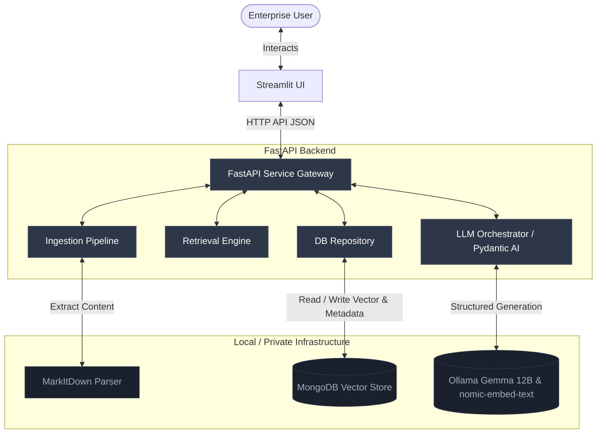

# Software Requirements Specification (SRS)
## Project: Enterprise RAG System

---

## 1. Introduction & Objectives

### 1.1 Objective
The purpose of this system is to deliver a production-grade, highly secure, and traceable Retrieval-Augmented Generation (RAG) platform. The system will allow enterprise users to ingest unstructured documents (PDF, DOCX, TXT, MD), convert them to structured markdown representation, index them semantically using the nomic-embed-text embedding model stored as vectors in MongoDB, and query them with strict schema-enforced, validated structured JSON responses generated by a local LLM (Ollama Gemma 12B) orchestrated via Pydantic AI.

### 1.2 System Boundary
All document ingestion, embedding generation, database storage, and LLM inferences must occur locally or within private enterprise networks to guarantee zero data leakage to third-party public AI providers.

---

## 2. System Architecture Diagram

Below is the conceptual high-level architecture diagram showing the data flow and system boundary:



---

## 3. Functional Requirements

### 3.1 Document Ingestion Pipeline (FR-ING-01)
* **FR-ING-01.1 Input Formats:** The system must accept files of type `.pdf`, `.docx`, `.txt`, and `.md`.
* **FR-ING-01.2 Conversion:** The system must utilize Microsoft `MarkItDown` to extract text from files and represent them in semantic Markdown (preserving lists, tables, headers).
* **FR-ING-01.3 Chunking Strategy:** The system must perform two levels of chunking:
  1. *Heading-Based:* Splitting content at major Markdown heading elements (`#`, `##`, `###`).
  2. *Semantic / Sliding Window:* Ensuring chunks do not exceed a maximum token boundary (e.g., 512 tokens) with a configurable overlap (e.g., 10%) to prevent context loss at chunk boundaries.
* **FR-ING-01.4 Metadata Extraction:** Each chunk must be tagged automatically with:
  * Document source name/path
  * File size and creation time
  * Header hierarchy path (e.g., `Introduction > Architecture > Database Selection`)
  * Document hash (to prevent duplicate ingestion)
  * Unique chunk ID

### 3.2 MongoDB Storage & Indexing (FR-IDX-02)
* **FR-IDX-02.1 Embedding Generation:** Chunks must be processed using the local `nomic-embed-text` embedding model hosted on Ollama, producing 768-dimensional vectors.
* **FR-IDX-02.2 Storage:** The raw chunk text, metadata payload, and vector embedding must be stored in a MongoDB collection.
* **FR-IDX-02.3 Vector Search Index:** A MongoDB Vector Search Index (`cosine` distance) must be defined on the embedding field to enable fast cosine similarity queries.

### 3.3 Retrieval Engine (FR-RET-03)
* **FR-RET-03.1 Semantic Search:** The engine must convert incoming natural language queries into embeddings and retrieve the Top-K closest matching chunks.
* **FR-RET-03.2 Metadata Filtering:** Queries must support hard filters on metadata fields (e.g., filtering search context to a specific document name or upload date range) prior to or during vector comparison.
* **FR-RET-03.3 Hybrid Ranking:** Implement a custom ranking algorithm (e.g., combining vector score and keyword matching density) to score and prioritize retrieved chunks.

### 3.4 LLM Orchestration & Structured Output (FR-LLM-04)
* **FR-LLM-04.1 Framework Integration:** Utilize **Pydantic AI** to define agents and strictly bind LLM execution outputs.
* **FR-LLM-04.2 Strict JSON Output:** Force the local Ollama Gemma 12B model to respond *only* with data conforming to a defined Pydantic class structure.
* **FR-LLM-04.3 Confidence Scoring:** The structured response must contain a calculated confidence score (0.0 to 1.0) indicating LLM confidence in its generated answer relative to the provided context.
* **FR-LLM-04.4 Source Citation:** The structured response must contain an array of source document names and specific chunk references supporting the answer.
* **FR-LLM-04.5 Hallucination Control:** If retrieved context is insufficient to answer the query, the LLM must return a designated status (e.g., `insufficient_context`) instead of fabricating an answer.

### 3.5 User Interface (FR-UI-05)
* **FR-UI-05.1 Document Portal:** Provide a file uploader allowing drag-and-drop file ingestion.
* **FR-UI-05.2 Conversational Chat Interface:** Input box for queries, with clear display of:
  * The structured answer (formatted beautifully)
  * LLM confidence score
  * Expanding panels listing the exact document citations and retrieved chunks.
* **FR-UI-05.3 System Status Display:** Monitor database and Ollama availability state.

---

## 4. Non-Functional Requirements

### 4.1 Security & Compliance (NFR-SEC)
* **NFR-SEC-01 Data Isolation:** No document contents, queries, or metadata are permitted to cross the local network boundaries. No remote APIs (like OpenAI, Anthropic, or Pinecone) are allowed.
* **NFR-SEC-02 Input Sanitization:** Prevent SQL/NoSQL injection and LLM prompt injection by sanitizing all REST payloads and parsing inputs via strict Pydantic types.

### 4.2 Performance & Scalability (NFR-PERF)
* **NFR-PERF-01 Vector Retrieval Latency:** Semantic retrieval of Top-K document chunks from MongoDB must take under 100ms for a collection size of 100,000 chunks.
* **NFR-PERF-02 Document Ingestion Speed:** Parsing and embedding generation must process documents at a rate of at least 5 pages per second on standard workstation GPUs (using local batching).
* **NFR-PERF-03 Token Throughput:** Gemma 12B generation should maintain an inference speed of at least 15 tokens per second.

### 4.3 Reliability & Traceability (NFR-REL)
* **NFR-REL-01 Exception Safeguards:** Ingestion or generation errors must degrade gracefully. An invalid model output must trigger structured retry policies inside Pydantic AI (up to 3 retries) before surfacing a system error.
* **NFR-REL-02 Audit Logging:** Standardize logging across all packages using structured JSON formatting. Logs must record:
  * Ingestion trace (file hash, elapsed parsing time, number of chunks created)
  * Query trace (query vector latency, number of candidates returned, LLM confidence score, token consumption).

---

## 5. API Design & Requirements

FastAPI will serve as the delivery system. The endpoints follow RESTful resource design and industry best practices.

### 5.1 Document Management API

#### 5.1.1 Upload Document
* **Endpoint:** `POST /api/v1/documents`
* **Content-Type:** `multipart/form-data`
* **Request Payload:**
  * `file`: Binary file upload
  * `metadata`: Optional JSON string containing custom tags or labels
* **Response Status:** `201 Created`
* **Response Body:**
```json
{
  "id": "doc_639b76b_2026",
  "filename": "annual_report.pdf",
  "status": "processing",
  "mime_type": "application/pdf",
  "size_bytes": 1048576,
  "hash": "e3b0c44298fc1c149afbf4c8996fb92427ae41e4649b934ca495991b7852b855",
  "created_at": "2026-07-06T20:37:28Z"
}
```

#### 5.1.2 Get Document Details / Status
* **Endpoint:** `GET /api/v1/documents/{document_id}`
* **Response Status:** `200 OK`
* **Response Body:**
```json
{
  "id": "doc_639b76b_2026",
  "filename": "annual_report.pdf",
  "status": "completed",
  "mime_type": "application/pdf",
  "size_bytes": 1048576,
  "chunks_count": 42,
  "hash": "e3b0c44298fc1c149afbf4c8996fb92427ae41e4649b934ca495991b7852b855",
  "created_at": "2026-07-06T20:37:28Z",
  "updated_at": "2026-07-06T20:39:10Z"
}
```

#### 5.1.3 Delete Document
* **Endpoint:** `DELETE /api/v1/documents/{document_id}`
* **Response Status:** `204 No Content`

### 5.2 RAG Query API

#### 5.2.1 Execute RAG Query
* **Endpoint:** `POST /api/v1/queries`
* **Content-Type:** `application/json`
* **Request Body:**
```json
{
  "query": "What are our financial targets for 2026?",
  "filters": {
    "filename": "annual_report.pdf"
  },
  "top_k": 5
}
```
* **Response Status:** `200 OK`
* **Response Body (Strict JSON Schema):**
```json
{
  "answer": "The financial target for 2026 is to reach $10M ARR with a gross margin of 75%.",
  "confidence_score": 0.94,
  "citations": [
    {
      "document_id": "doc_639b76b_2026",
      "filename": "annual_report.pdf",
      "heading_path": "Financial Projections > Target Summary",
      "text_snippet": "Gross margin target is set at 75% for fiscal year 2026..."
    }
  ],
  "metadata": {
    "latency_ms": 342,
    "tokens_used": 182,
    "model": "gemma4:latest"
  }
}
```

### 5.3 Health & Readiness API (Kubernetes Standards)

#### 5.3.1 Liveness Probe
* **Endpoint:** `GET /health`
* **Response Status:** `200 OK`
* **Response Body:**
```json
{
  "status": "healthy"
}
```

#### 5.3.2 Readiness Probe
* **Endpoint:** `GET /ready`
* **Response Status:** `200 OK` / `503 Service Unavailable`
* **Response Body:**
```json
{
  "status": "ready",
  "services": {
    "database": "connected",
    "ollama": "connected"
  }
}
```

---

## 6. Data Model Requirements

### 6.1 MongoDB Chunks Schema
Stored under the collection `document_chunks`:
* `_id`: ObjectId (Primary key)
* `doc_id`: UUID/String (Reference to parent document record)
* `filename`: String (Metadata)
* `hash`: String (SHA-256 hash of the parent file)
* `chunk_index`: Integer (Ordering identifier)
* `content`: String (Extracted Markdown chunk text)
* `heading_path`: String (Hierarchy location of the chunk)
* `embedding`: Array of Float (768 dimensions for nomic-embed-text)
* `token_count`: Integer (Metadata tracking)
* `created_at`: DateTime

---

## 7. Security Considerations

1. **Local Sandboxing:** The Docker/Local processes must not have egress routing to external AI endpoints.
2. **Strict Sanitization:** Query endpoints must reject strings containing potential prompt injection sequences (e.g. "Ignore previous instructions").
3. **No Dynamic Code Execution:** Disable any dynamic code or function evaluation tools inside the LLM model to avoid remote code execution (RCE).
