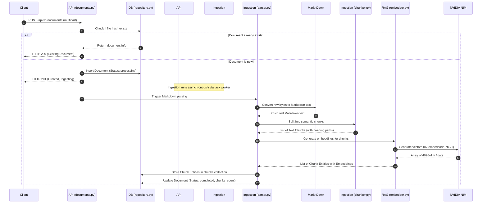
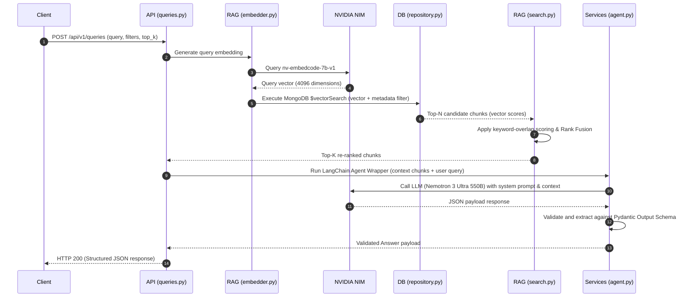

# System Architecture & Design Specification
## Project: Enterprise RAG System

---

## 1. High-Level Architecture

The system is architected around **Clean Architecture** principles to isolate dependencies, enforce a single flow of control, and ensure high testability. The application is divided into five logical domains:

1. **API Delivery Layer (`backend/api`):** Serves REST requests, performs payload validation via Pydantic, routes traffic to core services, handles exception translation, and implements liveness/readiness indicators.
2. **Ingestion & Parsing Layer (`backend/ingestion`):** Orchestrates raw byte extraction, handles MarkItDown operations, parses headers, and applies the chunking splits.
3. **Database & Storage Layer (`backend/db`):** Standardizes MongoDB connections, controls database transactions, and encapsulates CRUD/Repository operations.
4. **Retrieval Layer (`backend/rag`):** Manages vector embedding requests via LangChain OpenAIEmbeddings connecting to hosted NVIDIA NIM services, structures vector query operators, implements metadata filters, and performs the hybrid re-ranking.
5. **Reasoning & Generative Layer (`backend/services`):** Orchestrates the LangChain ChatNVIDIA agent, constructs contextual prompt inputs, sets retry boundaries, and enforces schema-conforming JSON replies.

---

## 2. Component Design & Directory Modules

Below is the structural breakdown of backend components:

```
backend/
├── api/
│   ├── routes/
│   │   ├── documents.py   # Upload and check document status
│   │   ├── queries.py     # Submit natural language queries
│   │   └── health.py      # Kubernetes standard liveness/readiness probes
│   ├── dependencies.py    # Database session and service registry DI provider
│   └── exceptions.py      # Global exception handlings & response standardizers
├── core/
│   ├── config.py          # Pydantic Settings loading environment configurations
│   └── logging.py         # Structured JSON logging formatters & middleware
├── db/
│   ├── client.py          # MongoDB client singleton and connection pool controller
│   └── repository.py      # Generic and specialized document repositories (ODM abstractions)
├── ingestion/
│   ├── parser.py          # Microsoft MarkItDown parsing wrappers
│   └── chunker.py         # Heading-aware and sliding token chunk splitter
├── models/
│   ├── schemas/           # API Request/Response Pydantic models
│   └── domain.py          # Pure Python schema representations of documents and chunks
├── rag/
│   ├── embedder.py        # LangChain embedding interface (nv-embedcode-7b-v1)
│   └── search.py          # Vector query builder and Hybrid re-ranking engine
└── services/
    └── agent.py           # LangChain ChatNVIDIA agent wrapper defining system parameters and schemas
```

---

## 3. Data Flow Design

### 3.1 Document Ingestion Flow

The sequential flow of document processing is detailed below:



### 3.2 RAG Query & Inference Flow

The retrieval and reasoning execution loop:



---

## 4. MongoDB Schema Design

The vector database operates on two collections. Metadata is duplicated inside chunks to allow single-stage, index-optimized filtering inside MongoDB's `$vectorSearch` pipeline.

### 4.1 Collection: `documents`
Stores parent metadata records:
```json
{
  "_id": "ObjectId",
  "filename": "string",
  "size_bytes": "int64",
  "mime_type": "string",
  "hash": "string", 
  "status": "string", // "processing", "completed", "failed"
  "chunks_count": "int32",
  "created_at": "date",
  "updated_at": "date"
}
```
* **Indexes:**
  * Unique index on `hash` to prevent duplicates: `db.documents.createIndex({ "hash": 1 }, { unique: true })`
  * Index on `filename` for fast metadata checks.

### 4.2 Collection: `document_chunks`
Stores actual document pieces along with embedding vectors:
```json
{
  "_id": "ObjectId",
  "doc_id": "ObjectId", // Reference to documents._id
  "filename": "string", // Duplicated metadata for filtering
  "chunk_index": "int32",
  "content": "string", // Markdown content string
  "heading_path": "string", // Breadcrumb locator
  "embedding": [0.012, -0.045, 0.982, "..."], // Array of 768 floats
  "token_count": "int32",
  "created_at": "date"
}
```
* **Indexes:**
  * **Vector Search Index (`vector_index`):**
    ```json
    {
      "fields": [
        {
          "type": "vector",
          "path": "embedding",
          "numDimensions": 768,
          "similarity": "cosine"
        },
        {
          "type": "filter",
          "path": "filename"
        }
      ]
    }
    ```
  * Index on `doc_id` for fast deletes on cascade: `db.document_chunks.createIndex({ "doc_id": 1 })`

---

## 5. API Contracts

### 5.1 POST `/api/v1/documents`
* **Request:** `multipart/form-data` with file bytes.
* **Success Response (201 Created):**
```json
{
  "id": "60c72b2f9b1d8a23d8c8e1a1",
  "filename": "q2_forecast.pdf",
  "status": "processing",
  "mime_type": "application/pdf",
  "size_bytes": 45892,
  "hash": "8f3a1b2c3d...",
  "created_at": "2026-07-06T20:47:00Z"
}
```

### 5.2 GET `/api/v1/documents/{document_id}`
* **Success Response (200 OK):**
```json
{
  "id": "60c72b2f9b1d8a23d8c8e1a1",
  "filename": "q2_forecast.pdf",
  "status": "completed",
  "mime_type": "application/pdf",
  "size_bytes": 45892,
  "chunks_count": 8,
  "hash": "8f3a1b2c3d...",
  "created_at": "2026-07-06T20:47:00Z",
  "updated_at": "2026-07-06T20:48:12Z"
}
```

### 5.3 POST `/api/v1/queries`
* **Request (application/json):**
```json
{
  "query": "What is our Q2 projected growth?",
  "filters": {
    "filename": "q2_forecast.pdf"
  },
  "top_k": 3
}
```
* **Success Response (200 OK):**
```json
{
  "answer": "Projected growth for Q2 is 12% quarter-over-quarter, driven by enterprise subscriptions.",
  "confidence_score": 0.91,
  "citations": [
    {
      "document_id": "60c72b2f9b1d8a23d8c8e1a1",
      "filename": "q2_forecast.pdf",
      "heading_path": "Financial Projections > Revenue Guidance",
      "text_snippet": "We project growth to accelerate in Q2 to 12% QoQ..."
    }
  ],
  "metadata": {
    "latency_ms": 482,
    "tokens_used": 194,
    "model": "gemma4:latest"
  }
}
```

---

## 6. Retrieval & Ranking Strategy Design

To maximize precision, the retrieval engine follows a **multi-stage hybrid retrieval** pattern without resorting to bloated orchestration frameworks.

### 6.1 Step 1: Pre-Filtered Vector Query
* Retrieve query embedding using LangChain OpenAIEmbeddings for the nv-embedcode-7b-v1 model hosted on NVIDIA NIM.
* Run a MongoDB vector search with exact pre-filters inside the search index (to restrict candidates to matching files if specified).
* Query pipeline example:
  ```json
  [
    {
      "$vectorSearch": {
        "index": "vector_index",
        "path": "embedding",
        "queryVector": [0.01, 0.02, "..."],
        "numCandidates": 50,
        "limit": 15,
        "filter": { "filename": "q2_forecast.pdf" }
      }
    }
  ]
  ```

### 6.2 Step 2: Scoring & Fusion (Re-ranking)
Each candidate chunk is scored dynamically using two components:
1. **Vector Cosine Score ($S_V$):** Returned directly from MongoDB `$vectorSearch` (representing semantic similarity). Normalized to $[0, 1]$.
2. **Keyword Density Score ($S_K$):** A computed overlap between query tokens and chunk content to prioritize precise keyword matches.
   $$S_K = \frac{|T_{query} \cap T_{chunk}|}{|T_{query}|}$$
   Where $T_{query}$ and $T_{chunk}$ represent tokenized, lowercased terms (excluding standard english stop words).

The final score $S_F$ is calculated via weighted linear fusion:
$$S_F = w \cdot S_V + (1 - w) \cdot S_K$$
* We default the semantic weight $w$ to $0.7$, providing high focus on meaning while prioritizing exact phrase matches when terms are identical.
* The Top-K (configurable, defaults to 5) chunks with the highest $S_F$ are returned to the generative layer.
